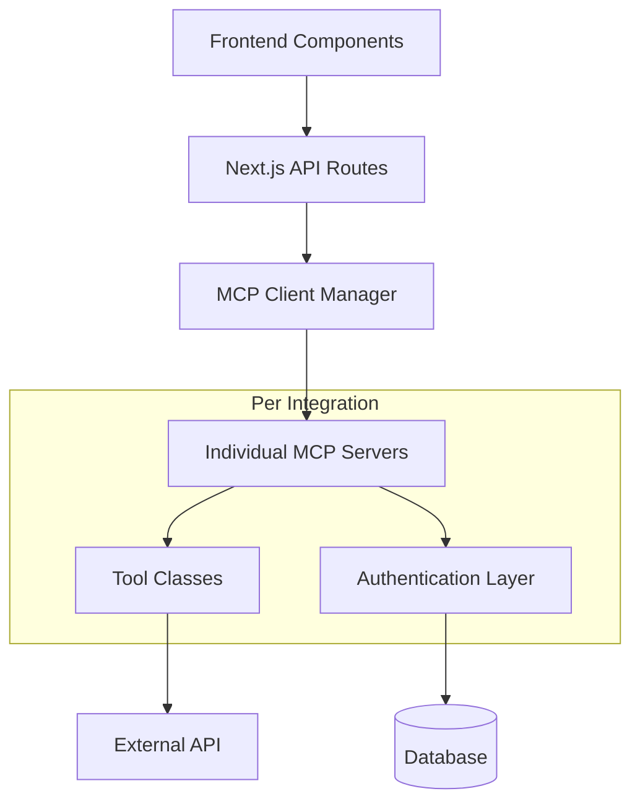

# MCP Integration Guide for AgMCP

This document outlines the standardized approach for creating new MCP (Model Context Protocol) integrations in the AgMCP platform, based on analysis of existing integrations (John Deere, Weather, USDA, EU Commission, and Auravant).

## 📋 Table of Contents

1. [Overview](#overview)
2. [Architecture Pattern](#architecture-pattern)
3. [Step-by-Step Integration Process](#step-by-step-integration-process)
4. [File Structure](#file-structure)
5. [Implementation Details](#implementation-details)
6. [Authentication Patterns](#authentication-patterns)
7. [API Route Integration](#api-route-integration)
8. [Client Manager Registration](#client-manager-registration)
9. [Testing Strategy](#testing-strategy)
10. [Best Practices](#best-practices)
11. [Common Patterns](#common-patterns)
12. [Troubleshooting](#troubleshooting)

## 🎯 Overview

AgMCP uses a modular MCP server architecture where each external API integration is implemented as:
- **MCP Server** - Handles tools and business logic
- **API Client** - Manages external API communication
- **Authentication Layer** - Handles auth tokens and permissions
- **Next.js API Routes** - Provides REST endpoints for the frontend
- **Database Models** - Stores tokens and connection status

## 🏗️ Architecture Pattern



## 🚀 Step-by-Step Integration Process

### 1. Planning Phase
- [ ] Define integration scope and tools needed
- [ ] Review external API documentation
- [ ] Identify authentication method (OAuth, API Key, etc.)
- [ ] Plan database schema for tokens/connection status
- [ ] Choose port number for MCP server

### 2. Database Schema
- [ ] Add integration fields to `User` model
- [ ] Create token storage table if needed
- [ ] Add any integration-specific data models

### 3. MCP Server Implementation
- [ ] Create server class extending `BaseMCPServer`
- [ ] Implement tool definitions and handlers
- [ ] Add authentication layer
- [ ] Create types and interfaces

### 4. API Integration
- [ ] Create Next.js API routes
- [ ] Implement authentication endpoints
- [ ] Add data retrieval endpoints

### 5. Client Manager Registration
- [ ] Register server in MCP Client Manager
- [ ] Add server to tool routing logic

### 6. Frontend Integration
- [ ] Add connection status indicators
- [ ] Create connection helpers/components
- [ ] Update data source selectors

### 7. Testing & Documentation
- [ ] Create test files
- [ ] Add integration to test suites
- [ ] Update documentation

## 📁 File Structure

For a new integration called `{service}`, create the following structure:

```
src/
├── mcp-servers/
│   └── {service}/
│       ├── server.ts              # Main MCP server class
│       ├── tools.ts               # Tool definitions and handlers
│       ├── types.ts               # TypeScript interfaces
│       └── auth.ts                # Authentication logic (if complex)
├── lib/
│   ├── {service}-api.ts           # API client library
│   └── {service}-auth.ts          # Auth helpers (if needed)
├── app/api/
│   ├── {service}/
│   │   └── {endpoint}/
│   │       └── route.ts           # REST API endpoints
│   └── auth/
│       └── {service}/
│           ├── connect/
│           │   └── route.ts       # Connection endpoint
│           ├── disconnect/
│           │   └── route.ts       # Disconnection endpoint
│           └── status/
│               └── route.ts       # Status endpoint
└── components/
    └── {Service}ConnectionHelper.tsx  # UI components
```

## 🔧 Implementation Details

### MCP Server Base Class

All MCP servers extend `BaseMCPServer`:

```typescript
export class {Service}MCPServer extends BaseMCPServer {
  private {service}Tools!: {Service}Tools
  private auth?: {Service}Auth  // If authentication needed

  constructor() {
    const config: MCPServerConfig = {
      name: '{service}-mcp-server',
      version: '1.0.0',
      port: parseInt(process.env.{SERVICE}_MCP_PORT || '{port}'),
      capabilities: {
        tools: {}
      }
    }
    super(config)
  }

  setupToolHandlers(): void {
    // Initialize auth if needed
    if (requiresAuth) {
      this.auth = new {Service}Auth()
    }
    
    // Initialize tools
    this.{service}Tools = new {Service}Tools(this.auth)

    // Register all tools
    const mcpTools = this.{service}Tools.getMCPTools()
    mcpTools.forEach(tool => {
      this.registerTool(tool)
    })

    MCPUtils.logWithTimestamp('INFO', `${this.config.name}: Registered ${mcpTools.length} tools`)
  }

  getAvailableTools(): Tool[] {
    return this.{service}Tools.getToolDefinitions()
  }

  protected async executeTool(name: string, args: any): Promise<MCPToolResult> {
    const tool = this.tools.get(name)
    if (!tool?.handler) {
      return MCPUtils.createErrorResult(`Tool not found: ${name}`)
    }

    try {
      return await tool.handler(args)
    } catch (error) {
      return MCPUtils.createErrorResult(
        `Error executing ${name}`,
        MCPUtils.formatError(error)
      )
    }
  }
}
```

### Tool Class Pattern

```typescript
export class {Service}Tools {
  private auth?: {Service}Auth
  private apiClient: {Service}APIClient

  constructor(auth?: {Service}Auth) {
    this.auth = auth
    this.apiClient = new {Service}APIClient(auth)
  }

  public getToolDefinitions(): Tool[] {
    return [
      {
        name: 'get_{service}_data',
        description: 'Get data from {service} API',
        inputSchema: {
          type: 'object',
          properties: {
            // Define parameters
          },
          required: ['requiredParam']
        }
      }
      // Add more tools...
    ]
  }

  public getMCPTools(): MCPTool[] {
    return [
      {
        name: 'get_{service}_data',
        description: 'Get data from {service} API',
        inputSchema: this.getToolDefinitions()[0].inputSchema,
        handler: this.getData.bind(this)
      }
      // Add more tools...
    ]
  }

  public async getData(args: {Service}ToolArgs): Promise<MCPToolResult> {
    try {
      // Validate required fields
      const missing = MCPUtils.validateRequiredFields(args, ['requiredParam'])
      if (missing.length > 0) {
        return MCPUtils.createErrorResult(
          `Missing required fields: ${missing.join(', ')}`
        )
      }

      // Check authentication if required
      if (this.auth && !await this.auth.authenticate()) {
        return MCPUtils.createErrorResult(
          '{Service} authentication required',
          'No valid authentication found. Please connect your {service} account.'
        )
      }

      // Make API call
      const data = await this.apiClient.getData(args)

      return MCPUtils.createSuccessResult(
        `✅ Retrieved data from {service}`,
        data,
        `Found ${data.length} items`
      )
    } catch (error) {
      const errorMessage = MCPUtils.formatError(error)
      MCPUtils.logWithTimestamp('ERROR', '{Service}: Failed to get data', error)
      return MCPUtils.createErrorResult(
        'Failed to retrieve data',
        errorMessage
      )
    }
  }
}
```

## 🔐 Authentication Patterns

### Pattern 1: OAuth 2.0 (like John Deere)

```typescript
export class {Service}Auth implements AuthenticationProvider {
  private config: {Service}AuthConfig
  private tokens: {Service}Tokens | null = null

  constructor() {
    this.config = {
      clientId: process.env.{SERVICE}_CLIENT_ID || '',
      clientSecret: process.env.{SERVICE}_CLIENT_SECRET || '',
      redirectUri: process.env.{SERVICE}_REDIRECT_URI || 'http://localhost:3000/api/auth/{service}/callback',
    }
  }

  async authenticate(): Promise<boolean> {
    if (!this.tokens) {
      await this.loadTokensFromStorage()
    }

    if (!this.tokens) {
      return false
    }

    // Check if token is valid
    if (await this.isTokenValid()) {
      return true
    }

    // Try to refresh
    return await this.refreshToken()
  }

  async refreshToken(): Promise<boolean> {
    // Implementation for token refresh
  }

  private async isTokenValid(): Promise<boolean> {
    // Implementation for token validation
  }

  private async loadTokensFromStorage(): Promise<void> {
    // Load from database or file system
  }

  private async saveTokensToStorage(): Promise<void> {
    // Save to database or file system
  }
}
```

### Pattern 2: API Key (like Weather API)

```typescript
export class {Service}Tools {
  private apiKey: string

  constructor() {
    this.apiKey = process.env.{SERVICE}_API_KEY || ''
    
    if (!this.apiKey) {
      MCPUtils.logWithTimestamp('WARN', '{Service}: Missing API key in environment variables')
    }
  }

  private async makeAuthenticatedRequest(url: string, options: any) {
    return fetch(url, {
      ...options,
      headers: {
        ...options.headers,
        'Authorization': `Bearer ${this.apiKey}`,
        // or 'X-API-Key': this.apiKey,
      }
    })
  }
}
```

### Pattern 3: Extension Token (like Auravant)

```typescript
export class {Service}Auth {
  static async generateTokenFromExtension(extensionId: string, secret: string): Promise<string> {
    const response = await fetch('https://api.{service}.com/api/auth/token', {
      method: 'POST',
      headers: { 'Content-Type': 'application/json' },
      body: JSON.stringify({
        extension_id: extensionId,
        secret: secret
      })
    })

    if (!response.ok) {
      throw new Error(`HTTP ${response.status}: ${response.statusText}`)
    }

    const data = await response.json()
    return data.token
  }

  static async validateToken(token: string): Promise<boolean> {
    try {
      const client = new {Service}Client(token)
      return await client.testConnection()
    } catch (error) {
      return false
    }
  }

  static async storeToken(userId: string, token: string): Promise<void> {
    await prisma.{service}Token.upsert({
      where: { userId },
      update: { 
        accessToken: token,
        updatedAt: new Date()
      },
      create: {
        userId,
        accessToken: token,
        tokenType: 'Bearer'
      }
    })

    await prisma.user.update({
      where: { id: userId },
      data: { {service}Connected: true }
    })
  }
}
```

## 🌐 API Route Integration

### Data Endpoints

```typescript
// src/app/api/{service}/{endpoint}/route.ts
import { NextRequest, NextResponse } from 'next/server'
import { get{Service}APIClient } from '@/lib/{service}-api'

export async function GET(request: NextRequest) {
  try {
    const { searchParams } = new URL(request.url)
    const param1 = searchParams.get('param1')
    const param2 = searchParams.get('param2') || 'default'

    // Validation
    if (!param1) {
      return NextResponse.json({ 
        error: 'param1 is required' 
      }, { status: 400 })
    }

    const {service}Client = get{Service}APIClient()
    const data = await {service}Client.getData(param1, param2)

    return NextResponse.json({
      success: true,
      data,
      timestamp: new Date().toISOString()
    })

  } catch (error) {
    console.error('{Service} API error:', error)
    return NextResponse.json(
      { error: 'Failed to fetch {service} data' },
      { status: 500 }
    )
  }
}
```

### Authentication Endpoints

```typescript
// src/app/api/auth/{service}/connect/route.ts
import { NextRequest, NextResponse } from 'next/server'
import { getServerSession } from 'next-auth'
import { authOptions } from '@/lib/auth-config'
import { {Service}Auth } from '@/lib/{service}/auth'

export async function POST(request: NextRequest) {
  try {
    const session = await getServerSession(authOptions)
    if (!session?.user?.id) {
      return NextResponse.json({ error: 'Unauthorized' }, { status: 401 })
    }

    const { credentials } = await request.json()

    // Validate credentials and generate token
    const token = await {Service}Auth.generateToken(credentials)
    
    // Test token validity
    const isValid = await {Service}Auth.validateToken(token)
    if (!isValid) {
      return NextResponse.json({ error: 'Invalid credentials' }, { status: 400 })
    }

    // Store token
    await {Service}Auth.storeToken(session.user.id, token)

    return NextResponse.json({
      success: true,
      message: '{Service} connected successfully'
    })

  } catch (error) {
    console.error('{Service} connection error:', error)
    return NextResponse.json(
      { error: 'Failed to connect to {service}' },
      { status: 500 }
    )
  }
}
```

## 🔄 Client Manager Registration

Update `src/lib/mcp-client-manager.ts`:

```typescript
constructor(config?: Partial<MCPClientManagerConfig>) {
  this.config = {
    servers: [
      { name: 'weather', port: 8002, enabled: true },
      { name: 'john-deere', port: 8001, enabled: true },
      { name: 'usda', port: 8003, enabled: true },
      { name: 'eu-commission', port: 8004, enabled: true },
      { name: 'auravant', port: 8005, enabled: true },
      { name: '{service}', port: {port}, enabled: true }, // Add your integration
    ],
    // ... rest of config
  }
}
```

Update `src/lib/mcp-tools.ts`:

```typescript
// Add tool category
export const {SERVICE}_TOOLS: MCPTool[] = [
  // Tool definitions...
]

export const ALL_MCP_TOOLS: MCPTool[] = [
  ...FIELD_OPERATION_TOOLS,
  ...EQUIPMENT_MANAGEMENT_TOOLS,
  ...DATA_RETRIEVAL_TOOLS,
  ...WEATHER_TOOLS,
  ...EU_COMMISSION_TOOLS,
  ...USDA_TOOLS,
  ...AURAVANT_TOOLS,
  ...{SERVICE}_TOOLS, // Add your tools
  ...FILE_MANAGEMENT_TOOLS,
]

// Add execution handler
async executeTool(toolName: string, parameters: any): Promise<MCPToolResult> {
  // ... existing code ...
  
  // {Service}
  if ({SERVICE}_TOOLS.find(tool => tool.name === toolName)) {
    return this.execute{Service}(toolName, parameters);
  }
  
  // ... rest of code ...
}

private async execute{Service}(toolName: string, parameters: any): Promise<MCPToolResult> {
  try {
    // Route to appropriate {service} API endpoint
    const response = await fetch(`/api/{service}/${toolName.replace('get_{service}_', '')}?${new URLSearchParams(parameters)}`)
    
    if (!response.ok) {
      throw new Error(`{Service} API error: ${response.status}`)
    }

    const data = await response.json()
    
    return {
      success: true,
      message: data.message || '{Service} data retrieved successfully',
      data: data.data
    }
  } catch (error) {
    return {
      success: false,
      message: `{Service} tool execution failed: ${error instanceof Error ? error.message : 'Unknown error'}`
    }
  }
}
```

## 🧪 Testing Strategy

### Unit Tests

```typescript
// src/lib/__tests__/{service}-tools.test.ts
import { {Service}Tools } from '../{service}-tools'

describe('{Service}Tools', () => {
  let tools: {Service}Tools

  beforeEach(() => {
    tools = new {Service}Tools()
  })

  test('should return tool definitions', () => {
    const definitions = tools.getToolDefinitions()
    expect(definitions).toHaveLength(expectedCount)
    expect(definitions[0].name).toBe('get_{service}_data')
  })

  test('should handle getData successfully', async () => {
    const result = await tools.getData({ requiredParam: 'test' })
    expect(result.success).toBe(true)
    expect(result.data).toBeDefined()
  })

  test('should handle missing required parameters', async () => {
    const result = await tools.getData({})
    expect(result.success).toBe(false)
    expect(result.message).toContain('Missing required fields')
  })
})
```

### Integration Tests

```typescript
// tests/{service}-integration.test.ts
import { {Service}MCPServer } from '../src/mcp-servers/{service}/server'

describe('{Service} MCP Integration', () => {
  let server: {Service}MCPServer

  beforeAll(async () => {
    server = new {Service}MCPServer()
    await server.start()
  })

  afterAll(async () => {
    await server.stop()
  })

  test('should list available tools', async () => {
    const tools = server.getAvailableTools()
    expect(tools.length).toBeGreaterThan(0)
  })

  test('should execute tools successfully', async () => {
    const result = await server.executeTool('get_{service}_data', { requiredParam: 'test' })
    expect(result.success).toBe(true)
  })
})
```

## ✅ Best Practices

### 1. Error Handling
- Always use `MCPUtils.createErrorResult()` for errors
- Always use `MCPUtils.createSuccessResult()` for success
- Log errors with `MCPUtils.logWithTimestamp()`
- Provide meaningful error messages to users

### 2. Validation
- Use `MCPUtils.validateRequiredFields()` for parameter validation
- Validate API responses before returning data
- Handle edge cases gracefully

### 3. Authentication
- Always check authentication before making API calls
- Handle token expiration and refresh automatically
- Store sensitive data securely in the database
- Never log sensitive information

### 4. Performance
- Implement caching where appropriate
- Use connection pooling for database operations
- Set appropriate timeouts for external API calls
- Consider rate limiting

### 5. Documentation
- Document all tool parameters and return values
- Include examples in tool descriptions
- Update API documentation when adding new endpoints
- Add inline comments for complex logic

### 6. Security
- Validate all inputs
- Use environment variables for sensitive configuration
- Implement proper CORS headers
- Follow OAuth 2.0 best practices for token handling

## 📋 Common Patterns

### Environment Variables
```bash
# .env.local
{SERVICE}_API_KEY=your_api_key
{SERVICE}_CLIENT_ID=your_client_id
{SERVICE}_CLIENT_SECRET=your_client_secret
{SERVICE}_REDIRECT_URI=http://localhost:3000/api/auth/{service}/callback
{SERVICE}_MCP_PORT={port}
```

### Database Schema Updates
```prisma
// prisma/schema.prisma
model User {
  // ... existing fields ...
  {service}Connected  Boolean @default(false)
  {service}Tokens     {Service}Token[]
}

model {Service}Token {
  id          String   @id @default(cuid())
  userId      String   @unique
  user        User     @relation(fields: [userId], references: [id], onDelete: Cascade)
  accessToken String
  refreshToken String?
  tokenType   String   @default("Bearer")
  expiresAt   DateTime?
  scope       String?
  createdAt   DateTime @default(now())
  updatedAt   DateTime @updatedAt
}
```

### Tool Naming Convention
- Use snake_case for tool names
- Prefix with service name: `get_{service}_data`
- Use descriptive names: `get_{service}_market_prices`
- Group related tools: `{service}_dashboard`, `{service}_reports`

### Port Allocation
- Weather: 8002
- John Deere: 8001  
- USDA: 8003
- EU Commission: 8004
- Auravant: 8005
- **Your service: Pick next available port (8006+)**

## 🔍 Troubleshooting

### Common Issues

1. **Tool Not Found**
   - Check tool registration in `setupToolHandlers()`
   - Verify tool name matches in all places
   - Ensure `getMCPTools()` includes the tool

2. **Authentication Failures**
   - Check environment variables are set
   - Verify token storage and retrieval
   - Test token validation logic
   - Check API credential configuration

3. **API Call Failures**
   - Verify endpoint URLs and parameters
   - Check network connectivity
   - Review API documentation for changes
   - Test with external tools (Postman, curl)

4. **Database Issues**
   - Run `npx prisma generate` after schema changes
   - Run `npx prisma db push` to update database
   - Check foreign key relationships
   - Verify user permissions

5. **MCP Server Not Starting**
   - Check port conflicts
   - Verify server registration in client manager
   - Review server configuration
   - Check logs for startup errors

### Debug Mode
Enable debug logging:
```typescript
MCPUtils.logWithTimestamp('DEBUG', 'Debug message', { data })
```

### Health Checks
Implement health check endpoints:
```typescript
public async getHealthCheck() {
  try {
    const baseHealth = await super.getHealthCheck()
    
    // Test API connectivity
    const testResult = await this.{service}Tools.testConnection()
    
    return {
      ...baseHealth,
      details: {
        ...baseHealth.details,
        {service}API: testResult ? 'connected' : 'disconnected',
        lastTest: new Date().toISOString()
      }
    }
  } catch (error) {
    return MCPUtils.createHealthCheck('unhealthy', null, MCPUtils.formatError(error))
  }
}
```

## 🎉 Conclusion

Following this guide ensures consistent, maintainable, and robust MCP integrations. Each integration should:

- ✅ Extend the `BaseMCPServer` class
- ✅ Implement proper authentication handling
- ✅ Use standardized error handling and logging
- ✅ Include comprehensive tool definitions
- ✅ Provide REST API endpoints
- ✅ Include proper validation and security
- ✅ Have appropriate test coverage
- ✅ Follow naming conventions
- ✅ Include health checks and monitoring

For questions or improvements to this guide, please refer to existing integrations as examples and maintain consistency with the established patterns.
