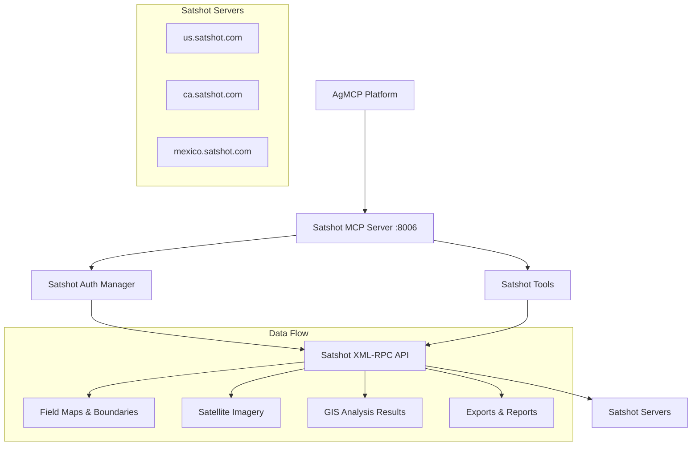

# Satshot GIS Integration Plan for AgMCP

## 📋 Overview

This document outlines the comprehensive integration plan for **Satshot** - a professional GIS and precision agriculture platform that provides satellite imagery analysis, field mapping, and agricultural insights. This integration will add powerful geospatial capabilities to AgMCP.

**Satshot API Documentation**: https://www.satshot.com/apidocs/

## 🛰️ What Satshot Provides

Satshot is a comprehensive **Geographic Information System (GIS)** and **precision agriculture platform** that offers:

### **Core Capabilities:**

#### 1. **Satellite Imagery & Analysis**
- High-resolution satellite and aerial imagery processing
- Multi-spectral image analysis for crop health assessment
- Temporal imagery comparison for crop monitoring
- Automated vegetation index calculations (NDVI, etc.)

#### 2. **Field Mapping & Management**
- Precise field boundary delineation and mapping
- Geographic coordinate management and projection
- Vector data creation and manipulation
- Common Land Unit (CLU) management with attributes

#### 3. **Precision Agriculture Tools**
- Field-specific crop analysis and recommendations
- Yield mapping and prediction capabilities
- Soil condition assessment through imagery
- Variable rate application mapping

#### 4. **Data Management & Export**
- Export to industry-standard formats (Shapefile, KML, GeoJSON)
- Integration with existing farm management systems
- Custom report generation with maps and analytics
- Historical data tracking and trend analysis

#### 5. **User & Entity Management**
- Multi-user access control and permissions
- Group-based data sharing and collaboration
- Client/farmer data organization
- Role-based access to different capabilities

#### 6. **Geographic Data Collection**
- Geotagged photo management and organization
- Field data record collection and storage
- GPS coordinate validation and correction
- Mobile-friendly data collection workflows

#### 7. **Automated Analysis & Monitoring**
- Scheduled automatic analysis of new imagery
- Alert system for crop stress detection
- Change detection between time periods
- Notification system for critical findings

### **Why This is Valuable for AgMCP:**

🌾 **Enhanced Field Intelligence** - Adds satellite-based crop monitoring to complement ground-based equipment data
🗺️ **Visual Context** - Provides maps and imagery to visualize field operations and conditions  
📊 **Advanced Analytics** - Sophisticated GIS analysis capabilities for precision agriculture
🔄 **Data Integration** - Bridge between field equipment data and geospatial intelligence
📈 **Historical Trends** - Long-term field performance and condition tracking
🚁 **Remote Monitoring** - Monitor fields without physical presence using satellite data

## 🏗️ Integration Architecture

### **Port Assignment**: 8006
### **Authentication**: Session-based with login/password
### **Protocol**: XML-RPC over HTTPS



## 📁 File Structure Plan

```
src/
├── mcp-servers/
│   └── satshot/
│       ├── server.ts              # Main Satshot MCP server
│       ├── tools.ts               # Satshot tool definitions
│       ├── types.ts               # TypeScript interfaces
│       ├── auth.ts                # Session management
│       └── client.ts              # XML-RPC client wrapper
├── lib/
│   ├── satshot-api.ts             # High-level API client
│   └── satshot-auth.ts            # Authentication helpers
├── app/api/
│   ├── satshot/
│   │   ├── maps/
│   │   │   └── route.ts           # Map services
│   │   ├── analysis/
│   │   │   └── route.ts           # Image analysis
│   │   ├── fields/
│   │   │   └── route.ts           # Field management
│   │   ├── imagery/
│   │   │   └── route.ts           # Satellite imagery
│   │   └── exports/
│   │       └── route.ts           # Data export
│   └── auth/
│       └── satshot/
│           ├── connect/
│           │   └── route.ts       # Login endpoint
│           ├── disconnect/
│           │   └── route.ts       # Logout endpoint
│           └── status/
│               └── route.ts       # Connection status
└── components/
    └── SatshotConnectionHelper.tsx # UI components
```

## 🔧 Implementation Plan

### **Phase 1: Foundation Setup**
1. **Database Schema Updates**
   ```prisma
   model User {
     // ... existing fields ...
     satshotConnected  Boolean @default(false)
     satshotTokens     SatshotToken[]
   }

   model SatshotToken {
     id          String   @id @default(cuid())
     userId      String   @unique
     user        User     @relation(fields: [userId], references: [id], onDelete: Cascade)
     sessionToken String  // "idtoken" from Satshot
     server      String   @default("us") // us, ca, mexico
     username    String?
     expiresAt   DateTime?
     lastUsed    DateTime @default(now())
     createdAt   DateTime @default(now())
     updatedAt   DateTime @updatedAt
   }
   ```

2. **Environment Variables**
   ```bash
   # .env.local
   SATSHOT_USERNAME=your_username
   SATSHOT_PASSWORD=your_password
   SATSHOT_SERVER=us  # us, ca, or mexico
   SATSHOT_MCP_PORT=8006
   ```

### **Phase 2: Core MCP Server**
1. **XML-RPC Client Implementation**
   - Create wrapper for XML-RPC communication
   - Handle session management and cookies
   - Implement error handling and retries

2. **Authentication System**
   - Login/logout functionality
   - Session token management
   - Multi-server support (US, CA, Mexico)
   - Token refresh and validation

3. **Base MCP Server**
   - Extend `BaseMCPServer`
   - Implement core tool registration
   - Add health checks and monitoring

### **Phase 3: Tool Implementation**

#### **Core Tools to Implement:**

1. **Map Management Tools**
   ```typescript
   - get_satshot_maps()           // List available maps
   - load_satshot_map()           // Load specific map context
   - get_map_boundaries()         // Get field boundaries
   - create_map_context()         // Create new map context
   ```

2. **Field Analysis Tools**
   ```typescript
   - analyze_field_imagery()      // Analyze satellite imagery for a field
   - get_field_ndvi()            // Get vegetation index data
   - compare_field_scenes()       // Compare imagery across time periods
   - get_crop_health_report()     // Generate crop health analysis
   ```

3. **Data Export Tools**
   ```typescript
   - export_field_boundaries()    // Export boundaries as Shapefile/KML
   - generate_field_report()      // Generate comprehensive field report
   - export_analysis_data()       // Export analysis results
   - get_historical_data()        // Get historical field data
   ```

4. **Imagery Tools**
   ```typescript
   - get_available_scenes()       // List available satellite scenes
   - download_field_imagery()     // Download imagery for specific field
   - get_scene_metadata()         // Get scene information and dates
   - calculate_vegetation_index() // Calculate NDVI, EVI, etc.
   ```

5. **Notification & Monitoring Tools**
   ```typescript
   - setup_field_monitoring()     // Set up automated monitoring
   - get_field_alerts()          // Get alerts for field conditions
   - create_analysis_notification() // Set up analysis notifications
   - get_change_detection()       // Detect changes in fields
   ```

### **Phase 4: API Routes**
1. **Data Endpoints**
   - `/api/satshot/maps` - Map management
   - `/api/satshot/analysis` - Image analysis
   - `/api/satshot/fields` - Field data
   - `/api/satshot/imagery` - Satellite imagery
   - `/api/satshot/exports` - Data export

2. **Authentication Endpoints**
   - `/api/auth/satshot/connect` - Login to Satshot
   - `/api/auth/satshot/disconnect` - Logout
   - `/api/auth/satshot/status` - Connection status

### **Phase 5: Frontend Integration**
1. **Connection Management**
   - Satshot connection helper component
   - Server selection (US/CA/Mexico)
   - Connection status indicators

2. **Data Visualization**
   - Map display integration
   - Imagery overlay capabilities
   - Analysis result visualization

## 🔐 Authentication Strategy

### **Session-Based Authentication Flow:**

1. **Initial Login**
   ```typescript
   // Login with username/password
   const sessionToken = await satshot.login(username, password)
   
   // Store session token securely
   await storeSatshotToken(userId, sessionToken, server)
   ```

2. **Session Management**
   ```typescript
   // Include session token in all API calls
   const result = await satshot.callMethod('method_name', params, {
     sessionToken: token
   })
   
   // Handle session expiration
   if (result.error === 'INVALID_SESSION') {
     await refreshSatshotSession(userId)
   }
   ```

3. **Multi-Server Support**
   ```typescript
   const servers = {
     us: 'https://us.satshot.com/xmlrpc.php',
     ca: 'https://ca.satshot.com/xmlrpc.php', 
     mexico: 'https://mexico.satshot.com/xmlrpc.php'
   }
   ```

## 🧪 Testing Strategy

### **Unit Tests**
- XML-RPC client functionality
- Authentication flow
- Tool parameter validation
- Error handling scenarios

### **Integration Tests**
- Full authentication cycle
- Map loading and analysis
- Data export functionality
- Multi-server connectivity

### **Mock Data**
- Sample field boundaries
- Mock satellite imagery metadata
- Test analysis results
- Synthetic NDVI data

## 📊 Use Cases & Value Proposition

### **Agricultural Intelligence Enhancement**
1. **Field Monitoring**: Monitor crop health using satellite imagery alongside equipment data
2. **Precision Agriculture**: Create variable rate application maps based on imagery analysis
3. **Historical Analysis**: Track field performance over multiple growing seasons
4. **Early Detection**: Identify crop stress, disease, or irrigation issues early
5. **Yield Prediction**: Combine satellite data with equipment data for better yield forecasting

### **Integration with Existing Data**
1. **John Deere + Satshot**: Correlate equipment operations with satellite-based field conditions
2. **Weather + Satshot**: Combine weather data with imagery for comprehensive field analysis
3. **USDA/EU + Satshot**: Compare local conditions with market trends and regional data

### **Workflow Examples**
1. **Field Health Assessment**:
   ```
   User: "How are my corn fields doing this season?"
   → Get field boundaries from Satshot
   → Analyze latest satellite imagery 
   → Calculate NDVI trends
   → Compare with historical data
   → Generate comprehensive health report
   ```

2. **Precision Application Planning**:
   ```
   User: "Where should I apply fertilizer in Field A?"
   → Load field boundary from Satshot
   → Analyze recent imagery for nutrient stress
   → Generate variable rate application map
   → Export prescription map for equipment
   ```

3. **Problem Area Detection**:
   ```
   User: "Are there any problem areas in my fields?"
   → Scan all fields for anomalies
   → Compare current vs historical imagery
   → Identify stress zones or changes
   → Prioritize areas needing attention
   ```

## 🎯 Success Metrics

### **Technical Metrics**
- [ ] Successful authentication and session management
- [ ] All core tools implemented and functional
- [ ] Sub-second response times for map operations
- [ ] Successful imagery analysis and export
- [ ] 99%+ uptime for MCP server

### **User Value Metrics**
- [ ] Seamless integration with existing AgMCP workflows
- [ ] Enhanced field insights compared to equipment data alone
- [ ] Successful generation of actionable reports
- [ ] Improved decision-making speed for field operations
- [ ] Integration with precision agriculture workflows

## 🚀 Implementation Timeline

### **Week 1: Foundation**
- Database schema updates
- XML-RPC client implementation
- Basic authentication system

### **Week 2: Core Server**
- MCP server implementation
- Basic tool registration
- Health checks and monitoring

### **Week 3: Essential Tools**
- Map management tools
- Basic field analysis
- Data export capabilities

### **Week 4: Advanced Features**
- Imagery analysis tools
- Notification system
- Frontend integration

### **Week 5: Testing & Polish**
- Comprehensive testing
- Documentation updates
- Performance optimization

## 🔄 Future Enhancements

### **Phase 2 Features**
- Real-time change detection alerts
- Advanced vegetation index calculations
- Custom analysis workflows
- Mobile app integration

### **Advanced Integrations**
- Combine with drone imagery data
- Integration with soil testing data
- Climate data correlation
- Predictive analytics using ML

### **Automation Features**
- Scheduled field monitoring
- Automated report generation
- Alert-based workflows
- API-driven field management

## 📋 Next Steps

1. **Review and approve this integration plan**
2. **Set up Satshot developer account and credentials**
3. **Begin Phase 1 implementation** following our MCP integration guide
4. **Test XML-RPC connectivity** with Satshot servers
5. **Implement basic authentication flow**

This integration will significantly enhance AgMCP's capabilities by adding professional-grade GIS and satellite imagery analysis, providing users with comprehensive field intelligence that complements their existing equipment and weather data.

---

**Ready to proceed with implementation following our established MCP integration patterns!** 🛰️🚜
