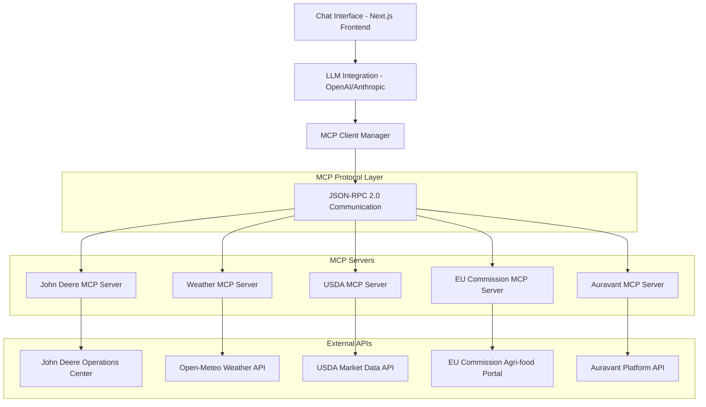
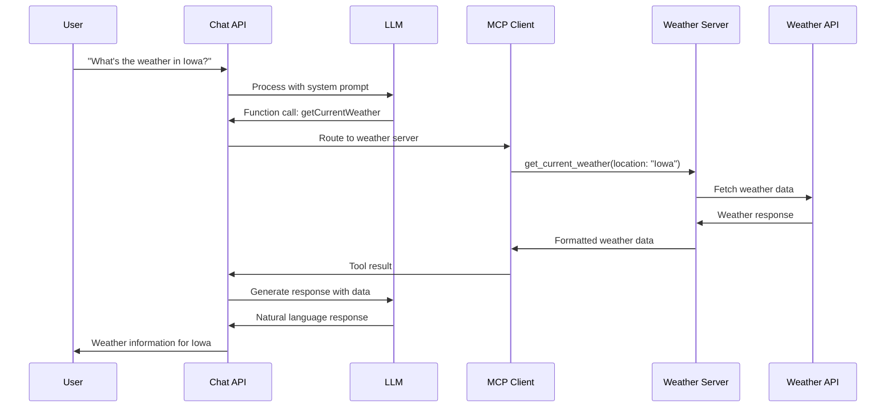
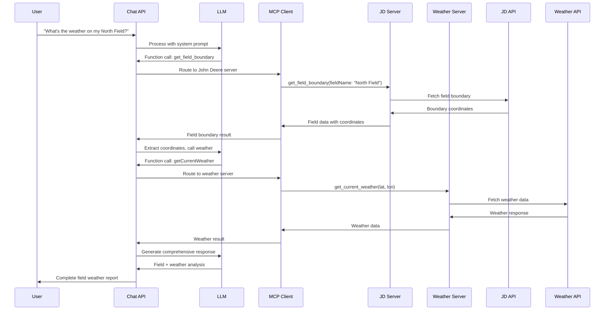
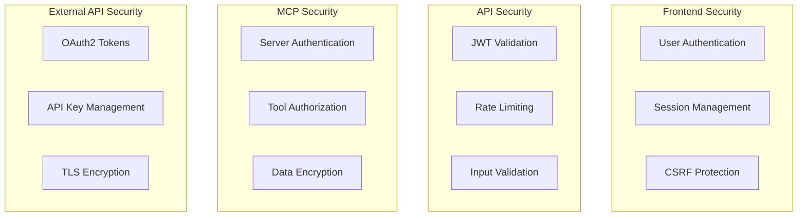
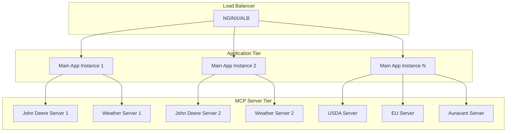

# MCP Architecture Overview - Distributed Agricultural Platform Integration

## Executive Summary

This document provides a comprehensive architectural overview of AgMCP's transition from a monolithic MCP tool executor to a distributed Model Context Protocol (MCP) architecture. The new design implements separate MCP servers for each agricultural platform, following industry best practices for scalable AI integration.

## Architecture Vision

### Core Philosophy
- **Separation of Concerns**: Each agricultural platform handled by dedicated MCP server
- **Standardized Communication**: JSON-RPC 2.0 protocol for all inter-service communication
- **Independent Scaling**: Platform-specific servers can scale based on demand
- **Fault Isolation**: Failures in one platform don't affect others
- **Maintainability**: Simplified debugging and feature development

### Design Goals
1. **Modularity**: Platform-specific logic encapsulated in dedicated servers
2. **Scalability**: Independent horizontal scaling of platform integrations
3. **Reliability**: Fault tolerance and graceful degradation
4. **Performance**: Optimized resource utilization and response times
5. **Developer Experience**: Simplified development and testing processes

## High-Level Architecture



## Architectural Components

### 1. Chat Interface Layer

#### Next.js Frontend Application
**Location**: `src/app/`
**Responsibilities**:
- User interface for agricultural chat interactions
- Session management and message handling
- File upload and data visualization
- Integration with authentication system

**Key Features**:
- Claude-style chat interface
- Multi-platform data source selection
- Real-time response streaming
- File drag-and-drop functionality
- Responsive design for mobile/desktop

#### Chat Completion API
**Location**: `src/app/api/chat/completion/route.ts`
**Responsibilities**:
- Process incoming chat requests
- Coordinate LLM function calling
- Route function calls to appropriate MCP servers
- Handle response aggregation and formatting

**Enhanced Architecture**:
```typescript
// Function routing logic
const serverMapping = {
  'getOrganizations': 'john-deere',
  'getFields': 'john-deere',
  'getEquipment': 'john-deere',
  'getCurrentWeather': 'weather',
  'getWeatherForecast': 'weather',
  'getUSDAMarketPrices': 'usda',
  'getEUMarketPrices': 'eu-commission',
  'getAuravantFields': 'auravant',
  // ... additional mappings
}
```

### 2. LLM Integration Layer

#### Language Model Service
**Location**: `src/lib/llm.ts`
**Responsibilities**:
- Interface with OpenAI/Anthropic models
- Function calling orchestration
- Agricultural system prompt management
- Response validation and formatting

**Function Discovery**:
```typescript
// Automatic tool registration from MCP servers
const ALL_FUNCTIONS = [
  ...JOHN_DEERE_FUNCTIONS,
  ...convertMCPToolsToFunctions(ALL_MCP_TOOLS)
]
```

#### Agricultural System Prompt
**Enhanced Features**:
- Platform-specific routing instructions
- Multi-step workflow guidance
- Error handling protocols
- Data visualization requirements

### 3. MCP Client Management Layer

#### MCP Client Manager
**Location**: `src/lib/mcp-client-manager.ts`
**Responsibilities**:
- Manage connections to multiple MCP servers
- Route function calls to appropriate servers
- Handle server failures and reconnection
- Load balancing and health monitoring

**Architecture Pattern**:
```typescript
export class MCPClientManager {
  private clients: Map<string, Client> = new Map()
  private serverProcesses: Map<string, any> = new Map()
  private healthChecks: Map<string, NodeJS.Timeout> = new Map()
  
  async connectToServer(serverName: string, serverPath: string): Promise<void>
  async callTool(serverName: string, toolName: string, parameters: any): Promise<any>
  async getAvailableTools(serverName: string): Promise<any[]>
  async disconnect(serverName: string): Promise<void>
}
```

### 4. MCP Protocol Layer

#### Standardized Communication
**Protocol**: JSON-RPC 2.0
**Transport**: stdio/HTTP/WebSocket
**Format**: Structured request/response with error handling

**Message Structure**:
```json
{
  "jsonrpc": "2.0",
  "method": "call_tool",
  "params": {
    "name": "get_current_weather",
    "arguments": {
      "latitude": 41.628,
      "longitude": -3.587
    }
  },
  "id": 1
}
```

#### Error Handling
- Standardized error codes and messages
- Graceful degradation on server failures
- Automatic retry mechanisms
- Circuit breaker patterns

### 5. MCP Server Layer

#### Base MCP Server Architecture
**Location**: `src/mcp-servers/base/mcp-server-base.ts`
**Responsibilities**:
- Common MCP server functionality
- Tool registration and execution
- Error handling and logging
- Health monitoring endpoints

**Abstract Interface**:
```typescript
export abstract class BaseMCPServer {
  protected server: Server
  protected serverName: string
  protected version: string

  abstract setupToolHandlers(): void
  abstract getAvailableTools(): Tool[]
  protected abstract executeTool(name: string, args: any): Promise<any>
}
```

#### Platform-Specific MCP Servers

##### John Deere MCP Server
**Location**: `src/mcp-servers/john-deere/`
**Port**: 8001
**Responsibilities**:
- John Deere API authentication (OAuth2)
- Farm data retrieval (fields, equipment, operations)
- File management operations
- Prescription upload functionality

**Tools Implemented**:
- `get_organizations` - Retrieve user organizations
- `get_fields` - Get field data for organization
- `get_equipment` - Retrieve equipment information
- `get_operations` - Get field operations history
- `get_field_boundary` - Retrieve field boundary coordinates
- `list_john_deere_files` - List files in JD account
- `upload_file_to_john_deere` - Upload prescription files

**Authentication Features**:
- OAuth2 flow management
- Automatic token refresh
- Rate limiting compliance
- Connection error handling

##### Weather MCP Server
**Location**: `src/mcp-servers/weather/`
**Port**: 8002
**Responsibilities**:
- Open-Meteo API integration
- Location geocoding
- Agricultural weather analysis
- Spray condition assessment

**Tools Implemented**:
- `get_current_weather` - Current conditions with agricultural insights
- `get_weather_forecast` - Multi-day forecasts (1-7 days)
- `search_locations` - Geographic location search

**Features**:
- Soil temperature and moisture data
- Evapotranspiration calculations
- UV index and spray conditions
- Precipitation probability analysis

##### USDA MCP Server
**Location**: `src/mcp-servers/usda/`
**Port**: 8003
**Responsibilities**:
- USDA market data integration
- North American agricultural statistics
- Trade data analysis
- Production reporting

**Tools Implemented**:
- `get_usda_market_prices` - Market pricing data
- `get_usda_production_data` - Production statistics
- `get_usda_trade_data` - Import/export data
- `get_usda_market_dashboard` - Comprehensive market overview

##### EU Commission MCP Server
**Location**: `src/mcp-servers/eu-commission/`
**Port**: 8004
**Responsibilities**:
- EU agricultural market data
- Production statistics across EU member states
- Trade data analysis
- Market trend reporting

**Tools Implemented**:
- `get_eu_market_prices` - European market pricing
- `get_eu_production_data` - Production statistics
- `get_eu_trade_data` - EU trade data
- `get_eu_market_dashboard` - Market dashboard

##### Auravant MCP Server
**Location**: `src/mcp-servers/auravant/`
**Port**: 8005
**Responsibilities**:
- Auravant platform integration
- Livestock management operations
- Work order processing
- Multi-language support

**Tools Implemented**:
- `get_auravant_fields` - Field management data
- `get_auravant_livestock` - Livestock operations
- `get_auravant_work_orders` - Work order management
- `get_auravant_labour_ops` - Labour operation tracking

**Authentication Features**:
- Bearer token management
- Extension-based authentication
- Multi-region support

### 6. External API Integration Layer

#### Platform-Specific API Clients
Each MCP server maintains its own API client for external platform communication:

- **John Deere API Client**: OAuth2, REST API integration
- **Weather API Client**: HTTP client with retry logic
- **USDA API Client**: Government API integration with rate limiting
- **EU Commission Client**: European data portal integration
- **Auravant Client**: Bearer token authentication, RESTful interface

## Data Flow Architecture

### 1. Simple Query Flow


### 2. Complex Multi-Platform Query Flow


## Security Architecture

### 1. Authentication and Authorization

#### Multi-Layer Security
- **Frontend Authentication**: NextAuth.js with session management
- **API Authentication**: JWT tokens and session validation
- **Platform Authentication**: OAuth2/Bearer tokens for external APIs
- **Inter-Service Communication**: Mutual TLS for production (optional)

#### Security Boundaries


### 2. Data Protection

#### Sensitive Data Handling
- **Encryption at Rest**: Database encryption for stored tokens
- **Encryption in Transit**: HTTPS/TLS for all communications
- **Token Management**: Secure storage and automatic rotation
- **Access Logging**: Comprehensive audit trails

#### Privacy Compliance
- **Data Minimization**: Only collect necessary agricultural data
- **User Consent**: Clear data usage permissions
- **Data Retention**: Automatic cleanup of expired sessions
- **Regional Compliance**: GDPR/CCPA compliance measures

## Performance Architecture

### 1. Scalability Design

#### Horizontal Scaling


#### Performance Optimizations
- **Connection Pooling**: Efficient database and API connections
- **Caching Strategies**: Redis for session and response caching
- **Request Batching**: Combine multiple API calls where possible
- **Async Processing**: Non-blocking I/O for all operations

### 2. Monitoring and Observability

#### Metrics Collection
```typescript
interface MCPMetrics {
  // Server Health
  serverUptime: Map<string, number>
  serverHealth: Map<string, boolean>
  
  // Performance Metrics
  responseTime: Map<string, number>
  throughput: Map<string, number>
  errorRate: Map<string, number>
  
  // Resource Utilization
  cpuUsage: Map<string, number>
  memoryUsage: Map<string, number>
  networkLatency: Map<string, number>
  
  // Business Metrics
  activeUsers: number
  queriesPerMinute: number
  platformUsage: Map<string, number>
}
```

#### Alerting Strategy
- **Critical Alerts**: Server failures, high error rates
- **Warning Alerts**: Performance degradation, resource usage
- **Info Alerts**: Deployment notifications, usage patterns

## Deployment Architecture

### 1. Container Strategy

#### Docker Configuration
```dockerfile
# Multi-stage build for MCP servers
FROM node:18-alpine AS builder
WORKDIR /app
COPY package*.json ./
RUN npm ci --only=production

FROM node:18-alpine AS runtime
WORKDIR /app
COPY --from=builder /app/node_modules ./node_modules
COPY dist/ ./dist/
EXPOSE 8000
CMD ["node", "dist/mcp-servers/john-deere/server.js"]
```

#### Orchestration with Docker Compose
```yaml
version: '3.8'
services:
  john-deere-mcp:
    image: agmcp-john-deere-mcp:latest
    ports: ["8001:8000"]
    environment:
      - NODE_ENV=production
      - JOHN_DEERE_CLIENT_ID=${JOHN_DEERE_CLIENT_ID}
    healthcheck:
      test: ["CMD", "curl", "-f", "http://localhost:8000/health"]
      interval: 30s
      timeout: 10s
      retries: 3
    restart: unless-stopped
```

### 2. Production Deployment

#### Kubernetes Configuration (Future)
```yaml
apiVersion: apps/v1
kind: Deployment
metadata:
  name: john-deere-mcp
spec:
  replicas: 3
  selector:
    matchLabels:
      app: john-deere-mcp
  template:
    metadata:
      labels:
        app: john-deere-mcp
    spec:
      containers:
      - name: john-deere-mcp
        image: agmcp-john-deere-mcp:latest
        ports:
        - containerPort: 8000
        env:
        - name: NODE_ENV
          value: "production"
        resources:
          requests:
            memory: "256Mi"
            cpu: "250m"
          limits:
            memory: "512Mi"
            cpu: "500m"
```

## Future Architecture Considerations

### 1. Advanced Features

#### Service Mesh Integration
- **Istio/Linkerd**: Advanced traffic management
- **Circuit Breakers**: Automatic failure handling
- **Distributed Tracing**: Request flow visualization
- **Canary Deployments**: Gradual feature rollouts

#### Event-Driven Architecture
- **Message Queues**: Asynchronous processing capabilities
- **Event Sourcing**: Audit trail and replay capabilities
- **CQRS Pattern**: Command query responsibility segregation

### 2. AI/ML Enhancements

#### Intelligent Routing
- **Machine Learning**: Predict optimal server routing
- **Load Prediction**: Anticipate traffic patterns
- **Auto-Scaling**: Dynamic resource allocation

#### Enhanced Analytics
- **Usage Pattern Analysis**: Optimize based on user behavior
- **Performance Prediction**: Proactive issue detection
- **Recommendation Engine**: Suggest optimal farming actions

## Conclusion

The MCP-based architecture provides AgMCP with a robust, scalable, and maintainable foundation for agricultural platform integrations. By following industry best practices and implementing proper separation of concerns, the system is positioned for future growth and enhanced capabilities.

### Key Benefits Achieved
1. **Modularity**: Independent platform development and deployment
2. **Scalability**: Platform-specific scaling based on demand
3. **Reliability**: Fault isolation and graceful degradation
4. **Maintainability**: Simplified debugging and feature development
5. **Performance**: Optimized resource utilization and response times

### Next Steps
1. Complete implementation of all MCP servers
2. Comprehensive testing and validation
3. Production deployment with monitoring
4. Performance optimization and scaling
5. Advanced features and AI enhancements

This architecture establishes AgMCP as a leading platform for agricultural AI integration, providing farmers with reliable, scalable access to multiple agricultural data sources through a unified chat interface. 